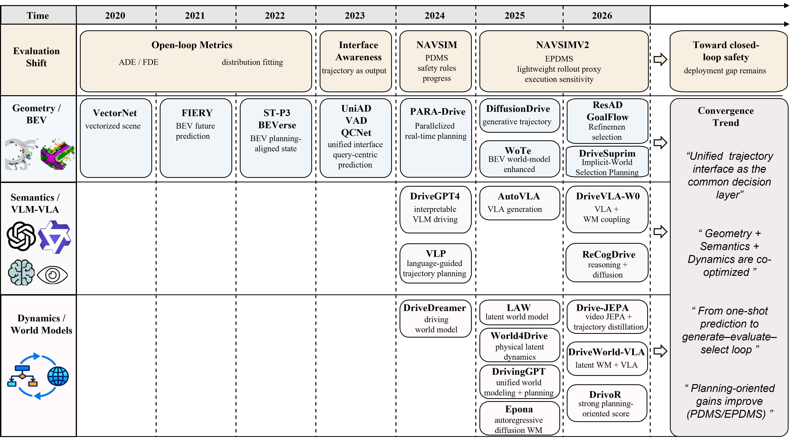
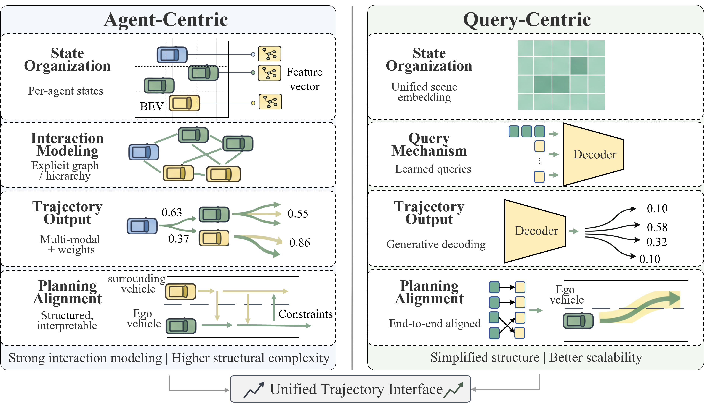
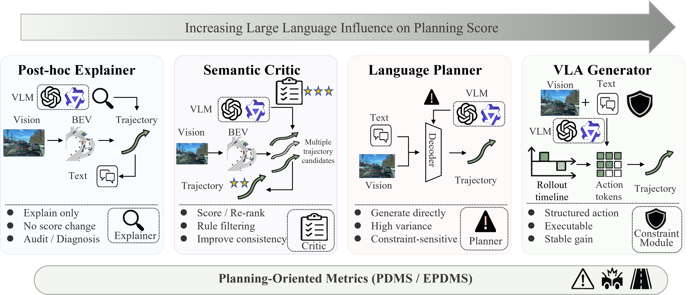
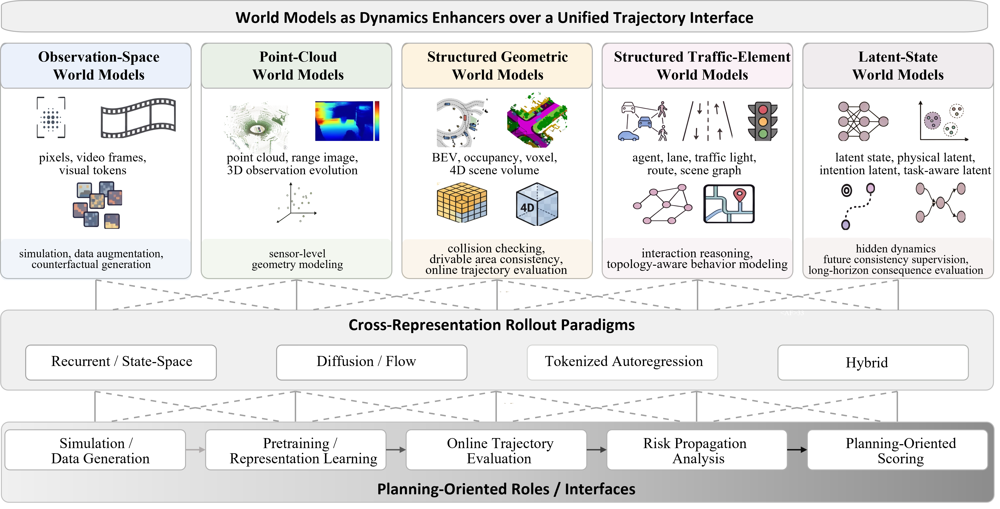

# Awesome Trajectory-Centric End-to-End Autonomous Driving

A curated literature list for trajectory-centric end-to-end autonomous driving under planning-oriented evaluation, with emphasis on BEV representations, VLM/VLA reasoning, world models, rollout-based planning, and benchmarks such as NAVSIM.

This repository is organized as a public reading map rather than a claim of exhaustive coverage. The first version is generated from the BibTeX references of the survey manuscript:

> An Overview of Trajectory-Centric End-to-End Autonomous Driving under Planning-Oriented Evaluation for AI-Enabled Transportation Systems

## Principles

- **Truthfulness first.** Code, project, and dataset links are not guessed. They are added only when explicitly verified.
- **Traceable metadata.** Paper titles, authors, venues, years, DOI, and arXiv IDs come from `bibliography/references.bib`.
- **Link source labels.** `DOI`, `arXiv`, and `URL` are direct links derived from BibTeX fields. Entries without a direct link are marked as search-only.
- **Easy maintenance.** The machine-readable paper table is stored in `papers/papers.tsv`; the Markdown list can be regenerated with `tools/generate_papers.py`.

## Contents

- [Surveys and Positioning](papers/paper_list.md#surveys-and-positioning)
- [VLM, VLA, Language, and Reasoning](papers/paper_list.md#vlm-vla-language-and-reasoning)
- [World Models, Rollout, and Generative Simulation](papers/paper_list.md#world-models-rollout-and-generative-simulation)
- [Planning-Oriented Evaluation and Benchmarks](papers/paper_list.md#planning-oriented-evaluation-and-benchmarks)
- [BEV, Occupancy, and Perception](papers/paper_list.md#bev-occupancy-and-perception)
- [Trajectory Prediction and End-to-End Planning](papers/paper_list.md#trajectory-prediction-and-end-to-end-planning)
- [Background: Intelligent Transportation and Autonomous Driving](papers/paper_list.md#background-intelligent-transportation-and-autonomous-driving)
- [Other Relevant Papers](papers/paper_list.md#other-relevant-papers)

## Visual Map

The following figures are copied from the survey assets for navigation and topic organization.









## Paper List

See [papers/paper_list.md](papers/paper_list.md) for the full categorized list.

## Repository Structure

```text
.
|-- README.md
|-- bibliography/
|   `-- references.bib
|-- papers/
|   |-- paper_list.md
|   `-- papers.tsv
|-- assets/
|   `-- figures/
|-- tools/
|   `-- generate_papers.py
|-- CONTRIBUTING.md
|-- LICENSE
`-- .gitignore
```

## Updating

After editing `bibliography/references.bib`, regenerate the paper table and Markdown list:

```bash
python tools/generate_papers.py
```

To verify direct DOI/arXiv/URL links:

```bash
python tools/verify_links.py
```

When adding `Code`, `Project`, or `Dataset` links, please verify the link against the paper, the authors' official page, the venue page, or an official organization repository before including it.

## Citation

If this reading list helps your work, please cite the original papers directly. A citation entry for the associated survey can be added after the manuscript is publicly available.
